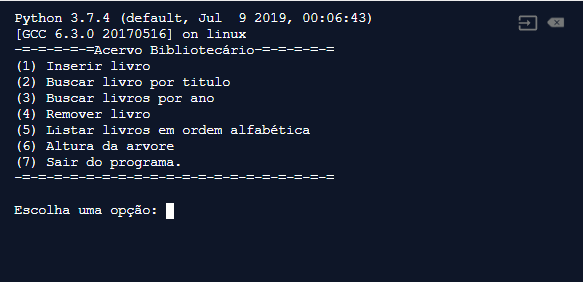

<h3 align="center">
  Application books :book:
</h3>

 
  Aplicação que gerencia o catalogo de livros de uma biblioteca.  

 
 Cada registro do catalogo contem o titulo do livro e ano de publicação. Os registros estão
  organizados em uma Arvore de Binária de Pesquisa (ABP), balanceada (AVL), cujas chaves
  são os títulos dos livros.

<h1 align="center">
  
</h1>
